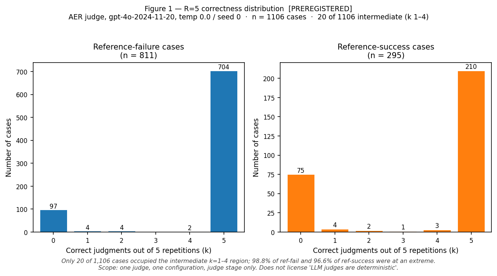
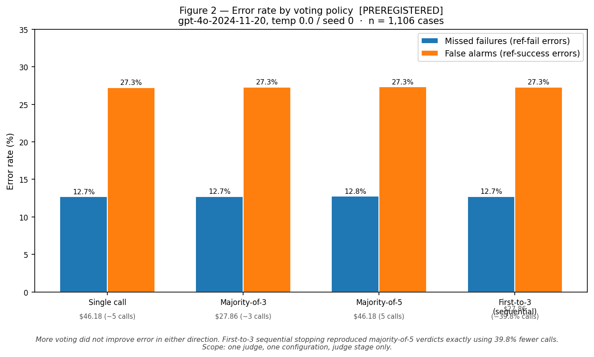
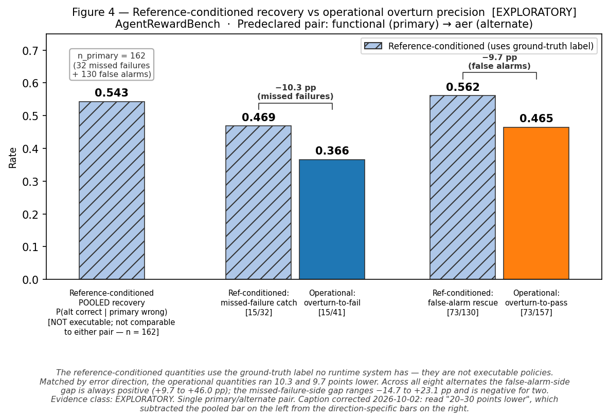
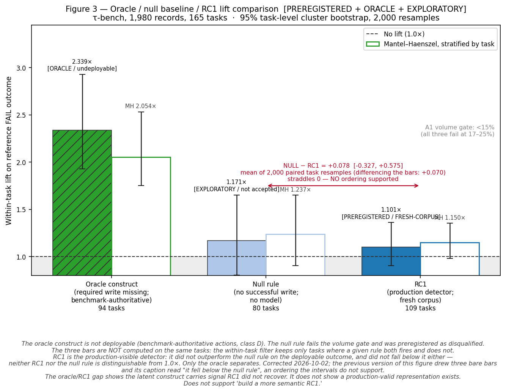

# Findings

*Evaluator-assurance falsification study. Closed 2026-09-29.*

Evidence-class key used throughout:
**[PRE]** Preregistered · **[HO]** Held-out · **[FRESH]** Fresh corpus, never touched ·
**[EXP]** Exploratory · **[QUAL]** Qualitative, n=15 · **[ORA]** Oracle/benchmark-authoritative

---

## 1. Scope

Two real corpora; no synthetic evidence enters any finding below.

| corpus | n | evidence quality |
|---|---|---|
| AgentRewardBench (rev `b6d17e6`) | 1,106 annotated agent trajectories | Preregistered pair selection; held-out rule validation |
| τ-bench (`historical_trajectories/`) | 1,980 trajectories, 165 tasks, 2 domains, 2 agents | Fresh corpus: never accessed before the RC1 preregistration commit |

Both corpora are class-A/fresh evidence for the claims below. The 25 documents of prior
analysis in `docs/` are the audit trail, not additional evidence.

---

## 2. Tier-1 findings

### T1.1 — Repeating this judge did not help **[PRE]**

| quantity | value |
|---|---|
| cases | 1,106 (811 reference-fail / 295 reference-success) |
| repetitions | R = 5 unconditional |
| calls / cost | 5,530 / $46.18 (44.7% prompt-cache discount applied) |
| deployed config | `gpt-4o-2024-11-20`, temperature 0.0, seed 0 |
| cases with intermediate correctness (k = 1–4) | **20** of 1,106 |
| fraction at an extreme (k = 0 or k = 5) | 98.8% ref-fail · 96.6% ref-success |
| majority-of-3 vs single call | marginally *worse* in both error directions |
| majority-of-5 vs single call | marginally *worse* in both error directions |
| first-to-3 stopping vs majority-of-5 | **identical verdicts**, 39.8% fewer calls, ≈$27.86 |

**What this licenses:** for this deployed configuration, repeated execution had too little
useful variability for majority voting to pay. First-to-3 stopping recovered all available
savings without any voting benefit.

**What this does not license:** "LLM judges are deterministic" — provider-side nondeterminism
is not excluded by five draws, and temperature-0 is not the same as no variability.
Scope: one judge, one corpus, judge stage only.

---

### T1.2 — The attractive recovery statistic was not the deployable quantity **[EXP]**

| quantity | value |
|---|---|
| predeclared pair recovery `P(alt correct \| primary wrong)` | **0.543** [0.466, 0.618] |
| operational overturn-to-fail precision | **0.366** (15/41) |
| operational overturn-to-pass precision | **0.465** (73/157) |
| gap: reference-conditioned vs operational | **20–30 points** |
| blanket adjudication on primary FAIL | 73 correct / 84 wrong = −11 net; non-positive for all 8 pairs |

The reference-conditioned quantity `P(alt correct | primary wrong)` conditions on a
ground-truth label no runtime system has. A policy overturns verdicts based on what two
judges say, not on which one is right — which is why operational precision ran 20–30 points
lower on the same data.

Primary errors: 162 = **32 missed failures** + **130 false alarms**. The pooled metric was
dominated by the false-alarm stratum.

**Evidence class:** EXPLORATORY — the analysis of what the deployed policy would actually
do was conducted after outcomes were visible. The predeclared pair selection is class A.

---

### T1.3 — Predeclaration changed the reported result **[PRE vs B]**

| pair selection | pooled recovery | evidence class |
|---|---|---|
| Predeclared (5 pre-outcome criteria) | **0.543** | **[PRE]** |
| Post-hoc best (`functional`→`gpt-4o-mini` axtree) | **0.759** | **[EXP]** oracle selection |

The predeclared pair ranked **last of eight** candidates on pooled recovery — a 21.6-point gap
in a report that would have read structurally identically either way. The same predeclared
pair ranks **tied first of eight** on missed-failure recovery (0.469), the operationally
relevant stratum. Both errors are visible only because the choice was locked before
outcomes.

---

### T1.4 — Static obligation matching failed fresh-corpus validation; the construct was not empty **[PRE/FRESH + ORA]**

| gate / quantity | value | verdict |
|---|---|---|
| A1: firing volume | 25.3% (501/1,980) vs <15% ceiling | **FAIL** |
| A2: trajectory lift | 1.165× vs ≥1.50× bar | **FAIL** |
| A2: task-level gate (1.25×) | ceiling 1.222× < threshold | **INVALID — unpassable by construction** |
| A3: extractor precision (label-blind) | 28/30 | **PASS** |
| Within-task lift, deployable outcome | 1.101× | — |

The task-level gate was mathematically unpassable: 81.8% of tasks held a failing trial,
capping any any-fail indicator at 1.222× — below the 1.25× threshold. It is
non-decision-bearing and not treated as a failure gate.

**The construct diagnostic (oracle only, class D):**

| rule | within-task lift | evidence class |
|---|---|---|
| Oracle construct (benchmark-authoritative actions) | **2.339×** | **[ORA]** — undeployable |
| Null rule (no successful write; no model) | 1.171× | **[EXP]** — exploratory, preregistered as disqualified |
| RC1 (production detector) | **1.101×** | **[PRE/FRESH]** |

The target construct contained real signal that RC1 failed to recover. The oracle
establishes that the latent construct carries signal; it does not establish that a
production-valid representation of it exists. RC1 also fell below a null baseline
requiring no obligation model. The oracle is not a forecast; the null rule fails the volume gate at
24.1% and was preregistered as disqualified before any computation.

---

## 3. Major negative results

**F1 — Repetition as a production recovery mechanism.** *Killed for this configuration.*
Scope: one judge (`aer`), temp 0.0 / seed 0, one corpus, judge stage only.

**F2 — Generic alternate-judge escalation.** *Heavily weakened.* Pooled recovery dominated
by the false-alarm stratum (130 of 162 errors). Operational overturn precision 20–30 points
below the reference-conditioned figure. Blanket FAIL adjudication non-positive for all 8 pairs.

**F3 — Structural independence implies error independence.** *Not supported.* Eight
alternates ordered by pooled φ the same way as their own sensitivity; the a-priori
independence argument did not predict measured correlation.

**F4 — A generic deterministic pre-check architecture.** *Not supported at n=4.* R1 (fires when
the agent calls `report_infeasible` while asserting the task was completed): rejected as
evidence against success — 0.51× lift, inverted, and 17 of 27 firings are true successes. Had
it been given veto power it would have helped 6 and harmed 14; it never was. Its escalation
half survives, narrowly: 33.3% evaluator error on firings against 15.2% elsewhere. R4 (fires
when the trajectory ends on a search-results page): rejected — the 1.20× enrichment for
reference-fail is real, but evaluator error is 16.1% on firings against 15.5% elsewhere, a
0.6-point difference. R4 tells you about the agent, not the evaluation.

**F5 — Static required-conjunct/tool-class matching.** *Rejected cross-corpus.* RC1 failed
both binding gates on fresh τ-bench data while its extractor passed 28/30 — the rule, not
parsing, failed.

---

## 4. The result that passed its test and then failed reproduction

**S4 — Evidence-gap escalation (R3): confounded with benchmark slice. [HO]**

R3 fires when the evaluator received a goal that references an image it cannot observe.
On the 1,260-case held-out arm it passed its preregistered test:

- Evaluator error: **25.6%** on R3-fired cases vs **14.4%** elsewhere (Fisher p = 0.0015)
- Fires on: 133 cases (10.6% of the validation arm)
- Already-correct escalations: **99 of 133**

This section called that the project's positive result until 2026-10-02, when an external
reproduction audit asked which benchmarks R3 fires in. The answer is one:

| benchmark | R3 fires | cases | judge error (R3 ignored) |
|---|---|---|---|
| visualwebarena | **133** | 290 | 22.4% |
| assistantbench | 0 | 128 | 3.9% |
| webarena | 0 | 373 | 19.8% |
| workarena | 0 | 468 | 11.1% |

The pooled comparison is therefore visualwebarena against three slices the judge finds
easier. Conditioned on slice it is **25.6% vs 19.7% (34/133 vs 31/157), Fisher p = 0.26** —
roughly half the separation, no longer significant. Of +11.2 pp pooled, +5.8 pp survives
conditioning and +5.4 pp is slice identity.
Reproduce: `python scripts/arb_r3_slice_check.py`.

Not a refutation. The residual runs in the predicted direction and the test is underpowered
at n=133 vs 157, so this is a rule left unproven, not one shown not to work. Settling it
needs a corpus where the evidence gap occurs outside a single benchmark.

**The disposition does not move; the reading does.** R3's preregistered disposition stays
ACCEPTED, because it met its criterion and the test ran as specified. Downgrading a
disposition after the fact on the strength of an analysis the preregistration never named
would be the same post-hoc move this document criticises elsewhere. What is withdrawn is what
the pass was taken to mean: R3 passed a test that, as specified, could not distinguish it from
a proxy for the hardest environment, so it is no longer quotable as a positive result of this
study.

R3 remains an escalation signal rather than a corrector, and its value remains a function of
human review cost. Both were true before and are unaffected.

**Why this was missed.** The preregistration states the hazard in one line — *any rule that
escalates hard cases passes this test* — and `research_synthesis.md` records
"visualwebarena-only firings" in a scope column. The risk and the fact that triggers it were
both written down, in different documents, and the conditioning was never run. The rule's
defence at the time was that its condition is structural and frozen in advance: true, and
irrelevant. Freezing a rule does not control for a covariate the test omits.

---

## 5. What these findings support and don't support

### Claim-scope table

| # | claim | evidence | class | scope | key limitation | allowed wording |
|---|---|---|---|---|---|---|
| C1 | Repeating this judge did not help | R=5, 1,106 cases | **[PRE]** | One judge, one config, judge stage | Not full-pipeline; provider nondeterminism not excluded | "On 1,106 trajectories, five repetitions produced intermediate correctness on only 20 cases; majority voting was marginally worse than a single call." |
| C2 | Stopping captures available savings | First-to-3: 0 mismatches, −39.8% calls | **[PRE]** | Same | Textbook method | "First-to-3 stopping reproduced majority-of-5 verdicts exactly using 39.8% fewer calls." |
| C3 | Predeclaration changed the headline | 0.543 vs 0.759 | **[PRE vs EXP]** | One corpus, 8 pairs | Post-hoc figure is oracle selection | "The predeclared pair ranked last of eight (0.543); post-hoc selection would have reported 0.759 in an identical report." |
| C4 | Reference-conditioned recovery ≠ deployable | 0.543 vs 0.366/0.465 | **[EXP]** | One pair, one corpus | Exploratory | "P(alt correct \| primary wrong) = 0.543; operational overturn precision 0.366 / 0.465." |
| C5 | Error directions must be separated | 32 vs 130; pooled φ 6.7×→1.6× | **[EXP]** | One corpus | Exploratory | "False alarms outnumbered missed failures 130 to 32; pooled metrics were dominated by the false-alarm stratum." |
| C6 | Deterministic pre-checks: mixed results | R1–R4 on 1,260 held-out (1,259 scored) | **[HO]** | 4 rules, one corpus | n=4; R2 (negative self-report on an imperative modification goal) had 13 eligible cases and 6 verdict changes — its 39.3% harm bound is rule-of-three at n=6, not a firing count | "Two of four failed held-out evaluation; one passed but is underpowered (rule-of-three harm bound 39.3% at n=6); one passed as an escalation signal." |
| C7 | ~~Evidence-gap escalation has held-out support~~ **Withdrawn 2026-10-02 — confounded with slice** | R3: 25.6% vs 14.4% pooled; 25.6% vs 19.7% within visualwebarena (p = 0.26) | **[HO]** | One rule, and all 133 firings in one benchmark | 99/133 already correct; corrects nothing; pooled test does not control for slice difficulty | "R3 identified a 133-case subset with 25.6% evaluator error against 14.4% elsewhere, but it fires only on visualwebarena; within that slice the contrast is 25.6% vs 19.7% (p = 0.26) and the preregistered test cannot separate the rule from the benchmark." |
| C8 | RC1 failed fresh-corpus validation | 25.3% vol, 1.165× lift, 28/30 extractor | **[PRE/FRESH]** | One rule, two domains | 1.4% reference noise floor | "RC1 failed both binding gates on τ-bench while its extractor passed at 28/30 — rule failure, not parsing failure." |
| C9 | The construct was not empty | Oracle 2.339× vs RC1 1.101× | **[ORA + PRE]** | τ-bench | Oracle is undeployable; oracle itself fails volume gate | "Reconstructed with benchmark-authoritative actions, the construct carried 2.339× lift; the production detector recovered it at 33.1% precision / 49.3% recall." |
| C10 | RC1 fell below a no-model baseline | 1.101× vs 1.171× null | **[EXP]** | τ-bench | Null rule preregistered as disqualified; volume 24.1%; partly constitutive of outcome | "A check requiring no obligation model ('did the agent write anything?') reached 1.171× where RC1 reached 1.101×." |

**Claims not supported by this evidence:**
- Unscoped claims about repetition — findings are scoped to one judge and one configuration
- "Obligation tracking doesn't work" (the construct is real; the detector failed)
- "Evaluator pairs don't help" (the operational quantity is underpowered at n=32)
- Any generalization to judges, configurations, or corpora not studied here

---

## 6. Process failures found in the research itself

13 process errors were found across 62 commits. **6** were caught before the outcomes of the
affected experiment were visible. **7** were caught only afterward — including a join-key
collision affecting 33% of τ-bench records that had already appeared in a published report.

The counts are asserted by `scripts/check_synthesis_counts.py` against the structured table
in `docs/research_synthesis.md` §10.

Notable findings from the process audit:

- A preregistered gate (A2-task, 1.25×) was mathematically unpassable by any rule — computed
  only after outcomes, so it was preregistered at an unreachable threshold.
- A direct measurement comparison (oracle vs null lift) compared two different outcome
  variables, inflating one by 6×. Caught and corrected before publication.
- The same error class (comparing rates across incompatible conditionals) recurred three
  times, each immediately after the prior instance was corrected and documented.

---

## 7. Links to full technical record

| document | what it contains |
|---|---|
| [`docs/research_synthesis.md`](research_synthesis.md) | Full 21-section synthesis; disposition table for all 7 mechanisms (§3.6); claim ledger with forbidden wordings (§9); process-failure audit (§10) |
| [`docs/repetition_study_predeclaration.md`](repetition_study_predeclaration.md) | Preregistration with three amendments — the retracted gate is evidence, not embarrassment |
| [`docs/repetition_study_findings.md`](repetition_study_findings.md) | Full repetition results |
| [`docs/agent_reward_bench_gate1.md`](agent_reward_bench_gate1.md) | AER pair predeclaration and evidence audit |
| [`docs/agent_reward_bench_directional.md`](agent_reward_bench_directional.md) | Operational vs reference-conditioned decomposition |
| [`docs/repair_validation_preregistration.md`](repair_validation_preregistration.md) | R1–R4 preregistration |
| [`docs/repair_validation_results.md`](repair_validation_results.md) | R1–R4 held-out results with counterfactuals |
| [`docs/required_conjunct_preregistration.md`](required_conjunct_preregistration.md) | RC1 preregistration and gate definition |
| [`docs/rc1_forensic_audit.md`](rc1_forensic_audit.md) | RC1 post-outcome analysis and six-figure correction chain |
| [`docs/rc1_successor_probe.md`](rc1_successor_probe.md) | Null-baseline comparison; branch closure |
| [`docs/production_signal_audit.md`](production_signal_audit.md) | Oracle-leakage classification of every rule input |

Reproducible scripts: `scripts/generate_figures.py`, `scripts/check_public_claims.py`,
`scripts/check_synthesis_counts.py`, `scripts/rc1_successor_probe.py`.
